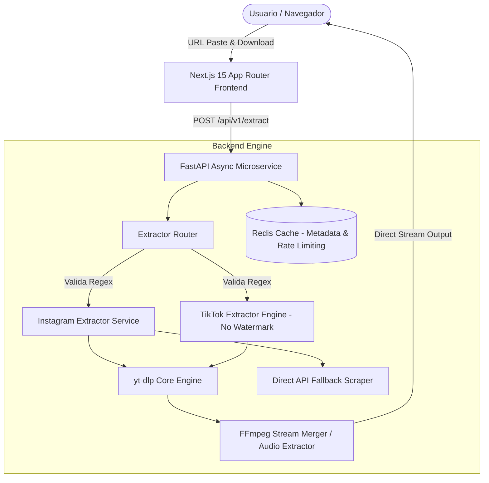
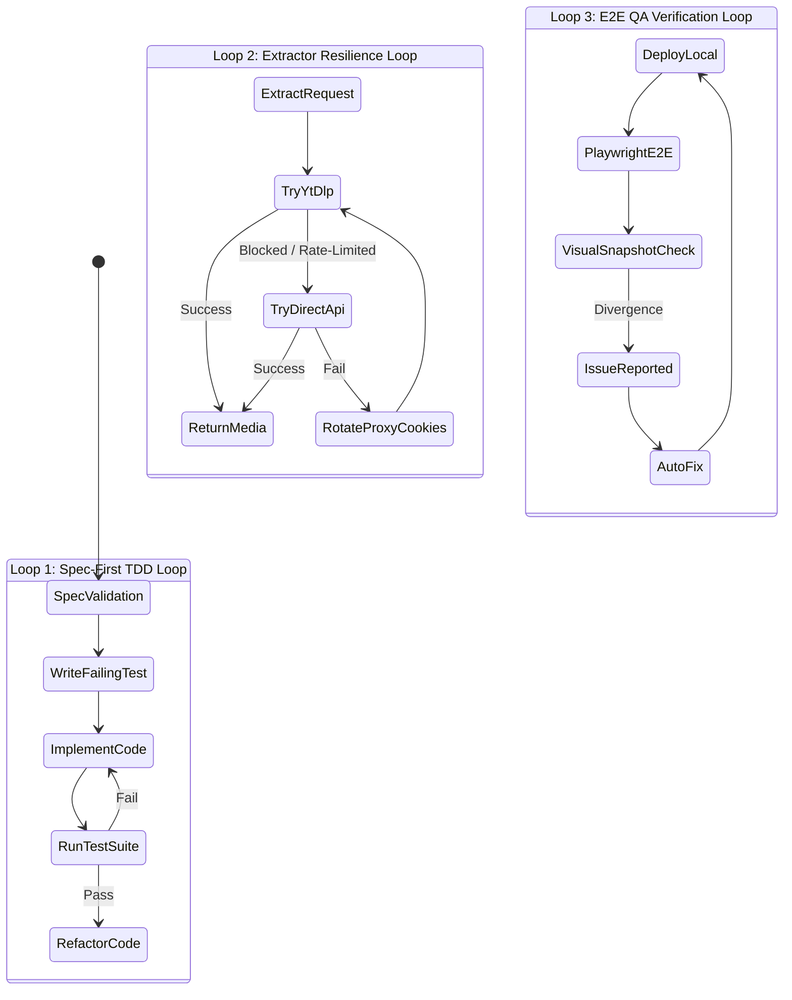

Una pregunta Estoy aquí en ChatGPT# 🚀 Master Plan: Downloader Web Application (Instagram & TikTok HD)

Este documento define la arquitectura de software, especificaciones técnicas (`specs`), estrategia de pruebas (`tests`), plan de ejecución por fases (`plans`) e **Implementación de Loops Agénticos** (en sustitución de prompts aislados) utilizando los estándares y skills globales de desarrollo.

---

## 📐 1. Arquitectura General del Sistema

El sistema utiliza una arquitectura desvinculada (Decoupled Microservice Architecture) para garantizar un rendimiento óptimo, alta escalabilidad y fácil mantenimiento:



---

## 🎨 2. Aplicación de Skills Globales de Diseño y Arquitectura

### 🎨 Design & UI/UX (`ui-ux-pro-max` + `frontend-design`)
* **Estilo Visual**: *Cyber-Glassmorphism Dark Mode* con paleta HSL balanceada (Fondo `#090D16`, Acentos Neón Cían `#00F2FE` y Violeta `#4FACFE`).
* **Interacciones Clave**:
  1. **Paste Auto-Detect**: Validación instantánea del enlace pegado en el clipboard.
  2. **Preview Card Interactive**: Vista previa en vivo con miniatura, título, duración, autor y selector de formato/calidad (1080p HD, 720p, Solo Audio MP3).
  3. **TikTok No-Watermark Switch**: Toggle nativo para alternar sin marca de agua.
  4. **Progress Feed**: Barra de progreso sutil y feedback dinámico de estado en tiempo real.

### ⚡ Backend API (`fastapi-templates` + `python-design-patterns`)
* **Framework**: FastAPI (Python 3.11+) con soporte completamente asíncrono (`asyncio` / `httpx`).
* **Patrón de Arquitectura**: *Clean Architecture / Layered Design* (`api/`, `core/`, `services/`, `extractors/`, `schemas/`).
* **Resiliencia Engine**: Cadena de responsabilidad (*Chain of Responsibility*) para motores de extracción con mecanismos de Retry & Fallback.

---

## 📜 3. Especificaciones Técnicas (`specs/downloader-spec.md`)

### 🔍 Contrato de Datos de Extracción (Schemas Pydantic)
```python
from pydantic import BaseModel, HttpUrl
from typing import List, Optional

class MediaFormatOption(BaseModel):
    format_id: str
    quality_label: str  # ej: "1080p Full HD", "720p HD", "Audio MP3"
    extension: str      # "mp4" | "mp3"
    has_watermark: bool
    filesize_approx_mb: Optional[float] = None
    download_url: str

class VideoExtractRequest(BaseModel):
    url: HttpUrl

class VideoExtractResponse(BaseModel):
    id: str
    platform: str # "instagram" | "tiktok"
    title: str
    author: str
    author_avatar: Optional[str] = None
    thumbnail: str
    duration_seconds: int
    formats: List[MediaFormatOption]
```

---

## 🔁 4. Loops Agénticos Autónomos ("Loops en vez de Prompts")

En lugar de depender de prompts estáticos independintes, el desarrollo y ejecución del proyecto se estructuran en **3 Loops Agénticos Continuos**:



1. **Loop 1: Spec-First TDD Execution Loop**
   * *Objetivo*: Escribir pruebas unitarias e integración que fallen primero según los specs, luego generar el código hasta que la suite pase al 100%.
   * *Acción de Control*: Reintento automático de refactorización si falla algún `pytest` o tipo TypeScript.

2. **Loop 2: Media Extractor Resiliency & Anti-Blocking Loop**
   * *Objetivo*: Manejar bloqueos de rate-limit o cambios de layout en Instagram/TikTok.
   * *Mapeo de Motores*: `yt-dlp` -> Proxy Rotation -> Cookie Sessions -> Direct API Scraping fallback.

3. **Loop 3: E2E Playwright Browser Validation Loop**
   * *Objetivo*: Validar flujos de usuario reales (pegar link, presionar descargar, verificar descarga de stream sin errores de CORS).

---

## 🗓️ 5. Plan de Trabajo por Fases (`plans/phase-breakdown.md`)

```
📁 project-root/
├── 📁 specs/
│   └── downloader-spec.md
├── 📁 tests/
│   ├── unit/
│   └── e2e/
├── 📁 backend/ (FastAPI)
│   ├── app/
│   │   ├── api/v1/
│   │   ├── core/
│   │   ├── extractors/
│   │   └── services/
│   └── tests/
└── 📁 frontend/ (Next.js 15)
    ├── app/
    ├── components/
    └── lib/
```

### 🔹 Fase 1: Especificaciones, Core Extractor & Backend Foundation
- [ ] Definir los specs completos en `specs/downloader-spec.md`.
- [ ] Inicializar proyecto FastAPI con estructura asíncrona conforme a `fastapi-templates`.
- [ ] Crear el extractor base para Instagram (Reels, Posts) y TikTok (videos sin marca de agua) usando `yt-dlp` + wrappers `asyncio`.
- [ ] Implementar middleware de manejo global de excepciones y esquemas Pydantic.

### 🔹 Fase 2: Interface Frontend Cyber-Glassmorphism (Next.js 15 + Tailwind CSS v4)
- [ ] Crear la app en Next.js App Router aplicando los patrones de `frontend-design` y `ui-ux-pro-max`.
- [ ] Diseñar componente `UrlInputField` con autocaptura de portapapeles, validación regex en tiempo real y sugerencias visuales.
- [ ] Implementar `MediaPreviewCard` con selector de calidad HD (1080p, 720p, MP3) y estados visuales (Loading Skeleton, Processing, Ready).
- [ ] Conectar con la API del Backend usando Server Actions / Proxy routes para evitar problemas de CORS.

### 🔹 Fase 3: Procesamiento de Streaming & FFmpeg Merging Engine
- [ ] Implementar streaming directo (`StreamingResponse` en FastAPI) para descargas inmediatas sin almacenar temporalmente archivos masivos en disco.
- [ ] Configurar ensamblador `FFmpeg` para combinar flujos independientes de video 1080p y audio de alta fidelidad cuando sea necesario.
- [ ] Configurar capa de caché en Redis para acelerar la extracción de metadatos repetidos por 1 hora.

### 🔹 Fase 4: Integración del Loop Agéntico y Suite de Pruebas Automáticas
- [ ] Configurar suite de pruebas unitarias en backend (`pytest` + `pytest-asyncio`).
- [ ] Implementar pruebas E2E con Playwright (`webapp-testing`) simulando la descarga completa desde el navegador.
- [ ] Integrar el Script de Evaluación Autónoma que ejecuta el Loop TDD y reporta métricas de éxito.

### 🔹 Fase 5: Optimizaciones, Anti-Blocking & Seguridad
- [ ] Configurar rotación de User-Agents y Headers para evasión de bloqueos en Instagram/TikTok.
- [ ] Implementar Rate Limiting (máximo 10 descargas por minuto por IP) usando Redis Token Bucket.
- [ ] Auditoría de seguridad (validación estricta de sanitización de URLs para evitar Server-Side Request Forgery - SSRF).

---

## 🧪 6. Estrategia de Testing (`tests/`)

### Pruebas Backend (`pytest`)
* **Unit Tests**:
  * Validadores de expresiones regulares para URLs de Instagram (Reels/Posts/TV) y TikTok (vm.tiktok, vt.tiktok, tiktok.com/@user/video).
  * Extracción de metadata sin descarga de binarios.
* **Integration Tests**:
  * Simulación de respuestas de red usando `respx` o `pytest-mock`.
  * Verificación de cabeceras de respuesta `Content-Disposition` para la descarga directa.

### Pruebas E2E (`Playwright` via `webapp-testing`)
* Test de flujo feliz:
  1. El usuario pega la URL de TikTok en el input.
  2. El botón cambia a estado cargando ("Analizando video...").
  3. Se muestra la vista previa con título y creador.
  4. El usuario selecciona calidad "HD Sin Marca de Agua" y da clic en "Descargar".
  5. Se valida el inicio del stream del archivo `.mp4`.

---

## 🎯 Próximos Pasos para Iniciar
1. Revisar y confirmar este plan maestro.
2. Proceder con la creación del repositorio e infraestructura base de la Fase 1.
